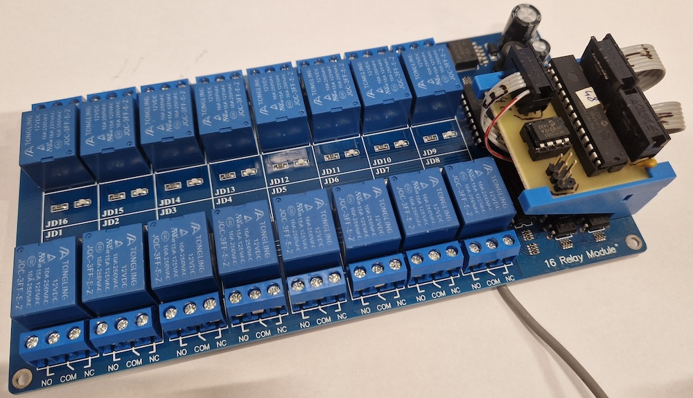
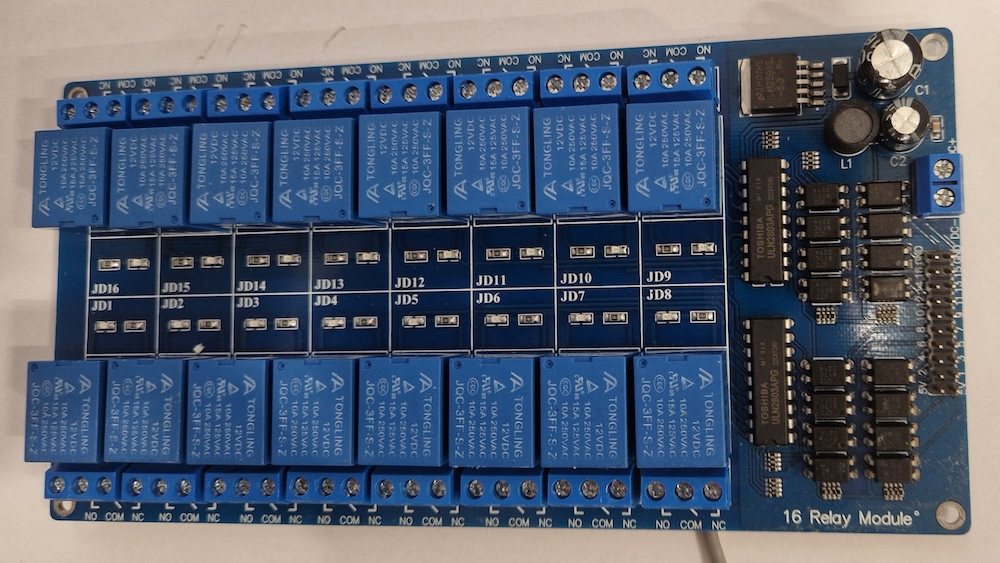
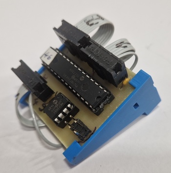
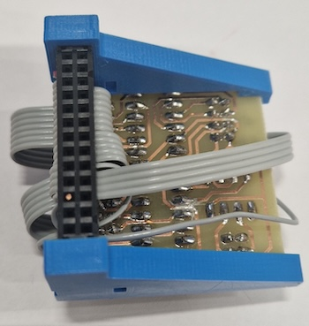
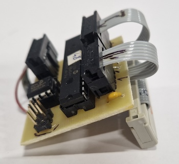
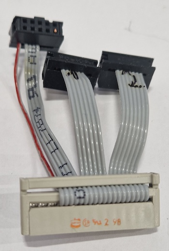

# 16 Relays board

Maps PIC board to "16 relay board".
This board is represented by Java class `Relay16BoardDevice`

**Note:** PIC board modification: VDD pin from CAN connector is removed, because PIC board is
powered from 5V generated by the relay board. 5V from board must not be connected with 5V

**Warning:** As pic board is powered via `Port3.VDD` pin, it is not fused. Be careful ;-)

## Parts
* 1x "_5V 12V 16 Channel Relay Module With Optocoupler Relay Output 1 2 4 6 8 Way Relay Module For Arduino In stock_relay module_module 5vmodule electronic - AliExpress_"
* 1x [PIC-board](../pic-board/pic-board.md)
* 1x 26-wire ribbon cable with connector
* 3x FC-8P connector

## Pin mapping

| Relay    | pic board |
|----------|-----------|
| 5V       | Port3.VDD |
| 5V       | -         |
| Relay.1  | Port3.1   |
| Relay.2  | Port3.2   |
| Relay.3  | Port3.3   |
| Relay.4  | Port3.4   |
| Relay.5  | Port1.6   |
| Relay.6  | Port1.5   |
| Relay.7  | Port1.4   |
| Relay.8  | Port1.3   |
| Relay.9  | Port1.2   |
| Relay.10 | Port1.1   |
| Relay.11 | Port2.6   |
| Relay.12 | Port2.5   |
| Relay.13 | Port2.4   |
| Relay.14 | Port2.3   |
| Relay.15 | Port2.2   |
| Relay.16 | Port2.1   |
| GND      | Port2.GND |
| GND      | -         |

## Photos

